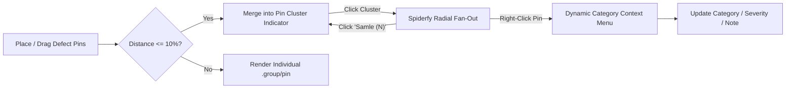
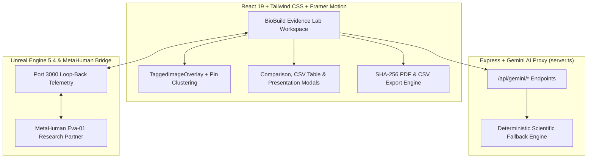

<div align="center">

# 🎬 BioBuild Evidence Lab v3.5.0 — GitHub Presentation Deck
### *The Scientific Engine for Alive Houses — Carbon-Negative Bio-Materials, Vision AI & Unreal Engine 5.4*

<!-- OFFICIAL GITHUB BADGES -->
[](./RELEASE_NOTES.md)
[-1d4ed8?style=for-the-badge&logo=githubactions)](./.github/workflows/ci.yml)
[](./README.md)
[](./README.md)
[](./README.md)
[](./README.md)

<br />

<!-- GITHUB QUICK START ACTION BUTTONS -->
[](https://ais-pre-e3apustmg4l4n7vsoxoit4-983598203489.europe-west2.run.app)
[](#-slide-2--vision-ai--pin-clustering-in-taggedimageoverlay)
[](#-slide-5--automated-testing--github-release-v350)
[](./RELEASE_NOTES.md)
[](./README.md#-windows-desktop-app-exe)

</div>

---

## 🧭 Executive Summary (Slide 1)

**BioBuild Evidence Lab** bridges biological material science, accredited laboratory testing, computer vision defect mapping, and real-time 3D simulation to accelerate **carbon-negative architecture (Alive Houses)**.

| Key Pillar | Capability | Standard / Technology | Status |
| :--- | :--- | :--- | :---: |
| **🧪 Bio-Material Registry** | Mycelium, Bacterial Bio-Cement (MICP), Hemp-Lime, Wood/Cork | TRL 1–9 • EPD GWP Tracking | ✅ Verified |
| **🎯 TaggedImageOverlay v2** | Pin Clustering, Spiderfy Expansion, Context Menu, Exit Animations | React 19 • Framer Motion • Lucide | ✅ Verified |
| **🛡️ Accredited Lab Proofs** | Fire Resistance, Compressive Strength (MPa), Moisture Buffering | ISO 1182 • ISO 12571 • EN 13501-1 | ✅ Verified |
| **🎮 Unreal 5 & MetaHuman** | Virtual Climate Chamber & Predictive Researcher Allocation | UE 5.4 Pixel Streaming • Gemini AI | ✅ Verified |
| **📑 Export & Reporting** | Official SHA-256 Attested PDF Reports (Single/Bulk) & Excel CSV | jsPDF • UTF-8 BOM CSV Exporter | ✅ Verified |

---

## 🎯 Slide 2 — Vision AI & Pin Clustering in `TaggedImageOverlay`

When inspecting high-resolution microscopy or climate-chamber test images, researchers often place multiple defect pins in close proximity.



### Key Interactive Enhancements
1. **Automatic Pin Clustering (`<= 10%` proximity)**: Nearby pins automatically merge into a single cluster badge at their geometric centroid with a pulsing halo, pin count, and hover preview list.
2. **Click-to-Expand (Spiderfy)**: Clicking a cluster fans the individual `.group/pin` markers out radially around the cluster center so every pin can be inspected, right-clicked, or dragged, with a central **`Samle (N)`** button to re-collapse.
3. **Dynamic Right-Click Context Menu**: Right-clicking any pin opens `.pin-context-menu` with dynamic category-colored borders (`Sprekk` Red, `Fukt` Blue, `Delaminering` Orange, `Misfarging` Amber, `Generelt` Emerald), quick severity buttons (`Lav`, `Moderat`, `Kritisk`), and instant text note editing.
4. **Category-Specific Lucide Icons & Exit Animation**: Renders `<ShieldAlert />`, `<Droplets />`, `<Layers />`, `<AlertTriangle />`, or `<Target />` next to category labels, and shrinks pins smoothly via Framer Motion `AnimatePresence` on deletion.

---

## 🌱 Slide 3 — Carbon-Negative EPD Benchmark Matrix

| Bio-Material | Category | GWP (kg CO₂e/kg) | Compressive Strength | Fire Class | TRL | Accreditation |
| :--- | :--- | :---: | :---: | :---: | :---: | :---: |
| **Mycelium-Hamp Kompositt** | Mykologiske | **-1.85** | 1.4 MPa | B-s1, d0 | TRL 8 | `SINTEF-BIO-2025-089` |
| **Bio-Betong (Sporosarcina)** | Alger & Bakterier | **-0.42** | 32.5 MPa | A1 | TRL 7 | `RISE-NO-2025-412` |
| **Hampkalk Bioblokk** | Plantebaserte | **-1.30** | 2.1 MPa | B-s1, d0 | TRL 9 | `DTI-DK-2024-901` |
| **Ekspandert Svartkork** | Tre & Kork | **-1.62** | 0.8 MPa | B-s2, d0 | TRL 9 | `SINTEF-BIO-2024-311` |

---

## 🎮 Slide 4 — System Architecture & Unreal 5.4 Loop-Back



---

## 🧪 Slide 5 — Automated Testing & GitHub Release v3.5.0

Run the complete verification pipeline directly from your terminal:

```bash
# 1. Run the 6-part automated test suite
npm test

# 2. Run TypeScript static verification
npm run lint

# 3. Build production client + server bundle
npm run build

# 4. Generate GitHub Release v3.5.0 bundle
npm run release:github
```
