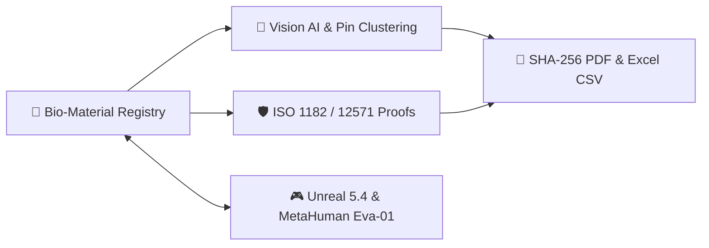

<div align="center">

# 🧪 BioBuild Evidence Lab v3.5.0 — Alive Houses
### *The Scientific Engine for Alive Houses — Carbon-Negative Bio-Materials, Vision AI & Unreal Engine 5.4*

<!-- STATUS & TECH STACK BADGES -->
[](./RELEASE_NOTES.md)
[-1d4ed8?style=for-the-badge&logo=githubactions)](./.github/workflows/ci.yml)
[](./tsconfig.json)
[](./package.json)
[](#🌱-carbon-negative-epd-benchmark-matrix)
[](#🛡️-iso-accreditation--export-engine)
[](#🎯-taggedimageoverlay--pin-clustering--context-menu)
[](#🎮-unreal-engine-54--metahuman-eva-01)

<br />

<!-- GITHUB QUICK START BUTTONS -->
[](https://ais-pre-e3apustmg4l4n7vsoxoit4-983598203489.europe-west2.run.app)
[](./PRESENTATION.md)
[](./RELEASE_NOTES.md)
[](#🎯-taggedimageoverlay--pin-clustering--context-menu)
[](#⚡-1-minute-quick-start-cli)
[](#🪟-windows-desktop-app-exe)

</div>

---

## ⚡ 1-Minute Quick Start (CLI)

```bash
# 1. Install dependencies
npm install

# 2. Run automated 6-part verification test suite
npm test

# 3. Start full-stack development server (Port 3000)
npm run dev

# 4. Run TypeScript check & production build
npm run lint && npm run build

# 5. Package GitHub Release v3.5.0 bundle
npm run release:github
```

---

## 🎬 Interactive GitHub Presentation (Expandable Slides)

> 💡 **Tip:** Click any slide below to expand or view the full standalone presentation in [**`PRESENTATION.md`**](./PRESENTATION.md).

<details open>
<summary><strong>📊 Slide 1: Vision & Core Architecture — The Scientific Engine for Alive Houses</strong></summary>
<br />

**BioBuild Evidence Lab** unifies biological material research, ISO-accredited lab testing, interactive defect mapping, and Unreal Engine 5.4 simulation into a single scientific workspace.



</details>

<details open>
<summary><strong>🎯 Slide 2: TaggedImageOverlay — Pin Clustering, Spiderfy & Dynamic Context Menu</strong></summary>
<br />

- **Automatic Pin Clustering (`<= 10%` threshold)**: When multiple defect markers are placed close together on a test image, they merge into a single cluster badge showing the total pin count, pulsing halo, and hover preview list.
- **Click-to-Expand (*Spiderfy*)**: Clicking a cluster indicator expands the individual `.group/pin` markers in a clean radial fan around the cluster center, with a central **`Samle (N)`** button to collapse them back.
- **Right-Click Context Menu (`.pin-context-menu`)**: Right-click any pin to instantly update its category (`Sprekk`, `Fukt`, `Delaminering`, `Misfarging`, `Generelt`), severity (`Lav`, `Moderat`, `Kritisk`), or text note — complete with dynamic category-colored borders and glow.
- **Dynamic Lucide Category Icons & Exit Animation**: Displays semantic icons (`ShieldAlert`, `Droplets`, `Layers`, `AlertTriangle`, `Target`) and shrinks pins smoothly on deletion via Framer Motion `AnimatePresence`.

</details>

<details>
<summary><strong>🌱 Slide 3: Carbon-Negative EPD Benchmark Matrix & Side-by-Side Comparison</strong></summary>
<br />

| Bio-Material | Category | GWP (kg CO₂e/kg) | Strength (MPa) | Fire Class | TRL | Accreditation |
| :--- | :--- | :---: | :---: | :---: | :---: | :---: |
| **Mycelium-Hamp Kompositt** | Mykologiske | **-1.85** | 1.4 MPa | B-s1, d0 | TRL 8 | `SINTEF-BIO-2025-089` |
| **Bio-Betong (Sporosarcina)** | Alger & Bakterier | **-0.42** | 32.5 MPa | A1 | TRL 7 | `RISE-NO-2025-412` |
| **Hampkalk Bioblokk** | Plantebaserte | **-1.30** | 2.1 MPa | B-s1, d0 | TRL 9 | `DTI-DK-2024-901` |
| **Ekspandert Svartkork** | Tre & Kork | **-1.62** | 0.8 MPa | B-s2, d0 | TRL 9 | `SINTEF-BIO-2024-311` |

</details>

<details>
<summary><strong>🎮 Slide 4: Unreal Engine 5.4 Bridge, MetaHuman Eva-01 & Predictive AI Allocation</strong></summary>
<br />

- **MetaHuman Eva-01**: Interactive virtual research partner with real-time facial rig telemetry (`blink`, `mouthOpen`, `neckTilt`, `creativeExpressiveness`).
- **Predictive Researcher Allocation**: Matches material chemical/biological profiles and researcher workload hours to recommend the optimal lead scientist.
- **User Spaces (Research Labs)**: Organize materials across dedicated lab spaces with one-click pinning and filtering.

</details>

---

## 🎯 `TaggedImageOverlay` — Pin Clustering & Context Menu

| Interaction | Action | Visual Feedback |
| :--- | :--- | :--- |
| **Place Pin** | Left-click image canvas | Animated crosshair & bounce-in numbered pin |
| **Cluster Merge** | Place/drag 2+ pins within `10%` | Merges into numbered cluster badge with hover list |
| **Expand Cluster** | Left-click cluster badge | Radial *spiderfy* fan-out + central `Samle (N)` button |
| **Highlight Pin** | Left-click pin or hover label | Enlarges pin (`1.25x`) & pulses category shadow glow |
| **Quick Edit Menu** | Right-click `.group/pin` | Opens category-bordered context menu with icons & note input |
| **Remove Pin** | Click `Slett` in tooltip/menu | Framer Motion `AnimatePresence` shrink exit (`scale: 0`) |

---

## 🛡️ ISO Accreditation & Export Engine

- **Single & Bulk PDF Reports**: Generate official laboratory reports with accreditation stamps, experiment logs, and SHA-256 verification hashes.
- **Excel CSV Exporter**: Export all or selected materials with UTF-8 BOM and European/Norwegian formatting (`;`-separated).

---

## 🪟 Windows Desktop App (`.EXE`)

Build or launch the standalone Windows Desktop installer directly:

```bash
npm run win:installer
npm run dist:win
```

---

## 📦 GitHub Release v3.5.0

- **Release Notes**: [`RELEASE_NOTES.md`](./RELEASE_NOTES.md)
- **Presentation Deck**: [`PRESENTATION.md`](./PRESENTATION.md)
- **Changelog**: [`CHANGELOG.md`](./CHANGELOG.md)
- **CI / Release Workflows**: [`.github/workflows/ci.yml`](./.github/workflows/ci.yml) & [`.github/workflows/release.yml`](./.github/workflows/release.yml)
